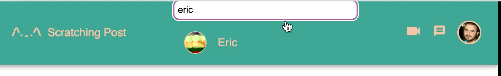

# The Scratching Post

    
Description

    A Social Media Platform that lets users post pictures with captions. Users are able to see public posts without any need of creating an account.
    Users who have accounts are able to like, comment, and follow or unfollow other users and their posts.
    They are able to set their privacy to either Public or Private and this status will reflect their posts as well.
    Users who have accounts are also able to take advantage of our messaging featureand our video call feature.
    Users are also able to share their posts or other people's posts with facebook and twitter.
    They are able to login through github using GitHubOATH and able to reset their password through nodemailer.
    The platform happens in realtime made possible by using Socket.IO and is designed using Material UI and styled-components and sample data is provided using Faker.

    
Tech Stack

    Javascript
    Express.js
    Node.js
    Git
    Webpack
    Babel
    React
    Redux
    Sequelize
    Bcrypt
    JSON Web Tokens
    Material UI
    Socket.IO
    styled-components
    Github OATH
    Faker

## Explore Page

## Feed Page

## Profile Page

## Search Functionality

## Login / Signup Functionality

## Follow Page
